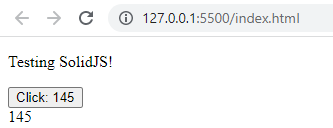

## SOLIDJS001 - first project with solid.js, see www.solidjs.com

## installation
- create a new project in nodejs 
- install the solidjs package: npm install solid-js
- open this project with Visual Code
- install Live Server extension
- right click on the index.html file and select "Open with Live Server" from context menu.
## result on browser 

